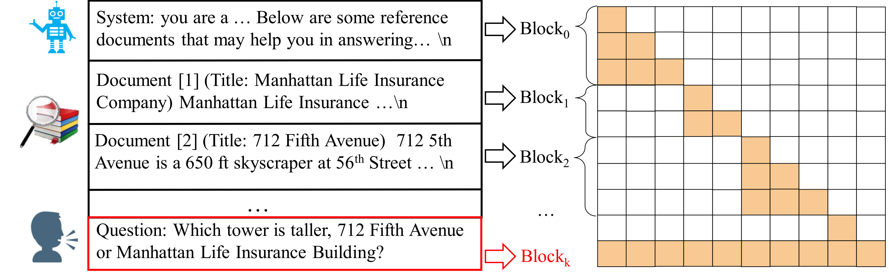

<div align="center">

# Block-Attention for Efficient Prefilling

</div>

<h5 align=center>

[](https://arxiv.org/abs/2409.15355)
[](https://huggingface.co/collections/ldsjmdy/block-attention-67c1b8def55c70c3eb23bbea)
[](https://github.com/TemporaryLoRA/Block-Attention)

</h5>

Implementation of paper [Block-Attention for Efficient Prefilling](https://arxiv.org/abs/2409.15355).

We introduce Block-attention, an attention mechanism designed to address the increased inference latency and cost in
Retrieval-Augmented Generation (RAG) scenarios.
Traditional approaches often encode the entire context in an auto-regressive manner.
Instead, Block-attention divides retrieved documents into discrete blocks, with each block independently calculating
key-value (KV) states except for the final block.
In RAG scenarios, by defining each passage as a block, Block-attention enables us to reuse the KV states of passages
that have been seen before, thereby significantly reducing the latency and the computation overhead during inference.
The implementation of Block-attention involves block segmentation, position re-encoding, and fine-tuning the LLM to
adapt to the Block-attention mechanism.
Experiments on 11 diverse benchmarks, including RAG, ICL, and general domains, demonstrate that after block fine-tuning,
the Block-attention model not only achieves performance comparable to that of full-attention models, but can also
seamlessly switch between the block and full attention modes without any performance loss.
Notably, Block-attention significantly reduces the time to first token (TTFT) and floating point operations (FLOPs) to a
very low level. It only takes 45 ms to output the first token for an input sequence with a total length of 32K. Compared
to the full-attention models, the TTFT and corresponding FLOPs are reduced by 98.7\% and 99.8\%, respectively.

Additionally, we also elaborate on how Block-attention is applied in Game AI scenario and the substantial potential
benefits it entails. We strongly suggest researchers in the gaming field not to overlook our work.



## 🔥 News

- **2025 March 1:** Code, datasets and model weights are released at [🤗 Huggingface](https://huggingface.co/collections/ldsjmdy/block-attention-67c1b8def55c70c3eb23bbea).
- **2024 Sep 15:** Paper available on [arXiv](https://arxiv.org/abs/2409.15355).

## 📋 Table of Contents

- [Block-Attention For Efficient Prefilling](#block-attention-for-efficient-prefilling)
    - [🔥 News](#-news)
    - [📋 Table of Contents](#-table-of-contents)
    - [🤗 Resources](#-resources)
    - [🚀 Getting Started](#-getting-started)
        - [🔧 Data Process](#-data-process)
        - [⚙️ Fine-tuning](#️-fine-tuning-models)
        - [♻️ Inference](#️-inference)
        - [📈 Evaluation](#-evaluation)
    - [📎 Citation](#-citation)

## 🤗 Resources

| Item                                   | Repository | Train Data |
| - | - | - |
| Tulu3-Block-FT Model | [🤗 ldsjmdy/Tulu3-Block-FT](https://huggingface.co/ldsjmdy/Tulu3-Block-FT) | [💾 Google Drive](https://drive.google.com/file/d/17kldAR2CIQPiNJ6ASW9et_GN_wqjFqfv/view?usp=sharing) |
| Tulu3-SFT Model (Baseline) | [🤗 ldsjmdy/Tulu3-SFT](https://huggingface.co/ldsjmdy/Tulu3-SFT) | [💾 Google Drive](https://drive.google.com/file/d/1hqKcQ3Qbc88WNVlxCfc-illfChc2Hzty/view?usp=sharing) |
| Tulu3-RAG Model (Baseline) | [🤗 ldsjmdy/Tulu3-RAG](https://huggingface.co/ldsjmdy/Tulu3-RAG) | [💾 Google Drive](https://drive.google.com/file/d/17kldAR2CIQPiNJ6ASW9et_GN_wqjFqfv/view?usp=sharing) | 

## 🚀 Getting Started

Although we release our processed dataset, we still release our scripts for processing
the raw data as below

---

### 🔧 Data Process

#### 1. Tulu-3 Dataset Process

**Note**: running following commands to prepare the Tulu-3 training dataset.

```bash 
mkdir -p datahub/
cd datahub

git lfs install 
git clone https://huggingface.co/datasets/allenai/tulu-3-sft-mixture
# if you cannot access the dataset through huggingface in mainland china, you could try following commands
# export HF_ENDPOINT=https://hf-mirror.com
# huggingface-cli download --repo-type dataset --resume-download allenai/tulu-3-sft-mixture --local-dir allenai/tulu-3-sft-mixture

mv tulu-3-sft-mixture tulu3
mv datahub/tulu3/data datahub/tulu3/hf

python3 data_process/tulu3/step0_split.py 
python3 data_process/tulu3/step1_run.py 
python3 data_process/tulu3/step2_run_block.py 
```

After completing the above steps, we will obtain `datahub/tulu3/sft.train` for supervised fine-tuning (SFT) and
`datahub/tulu3/block.train` for our Block-Attention fine-tuning.

#### 2. RAG Dataset Process

##### 2.1 Data Downloading

|    Dataset    |                                                                   Source                                                                   |
|:-------------:|:------------------------------------------------------------------------------------------------------------------------------------------:|
| 2WikiMultiHop |                                           https://huggingface.co/datasets/xanhho/2WikiMultihopQA                                           |
|    NQ, TQA    | https://github.com/facebookresearch/FiD/blob/main/get-data.sh; https://github.com/facebookresearch/DPR/blob/main/dpr/data/download_data.py |
|      HQA      |                                         https://github.com/hotpotqa/hotpot/blob/master/download.sh                                         |

##### 2.2 Data Prepare

**Note**: running following commands to prepare the datasets.

First of all, create the save folder for datasets under `Block-Attention` root folder.

```bash
mkdir -p datahub/tqa
#mkdir -p datahub/2wiki
mkdir -p datahub/nq
mkdir -p datahub/hqa
```

- 2WikiMultiHop

```bash
cd datahub
git lfs install 
git clone https://huggingface.co/datasets/xanhho/2WikiMultihopQA
# optional: downloading from hf-mirror.com
# export HF_ENDPOINT=https://hf-mirror.com
# huggingface-cli download --repo-type dataset --resume-download xanhho/2WikiMultihopQA --local-dir 2WikiMultihopQA
ln -s 2WikiMultihopQA 2wiki
```

- NQ、TQA

```bash 
cd Block-Attention/datahub 
git clone https://github.com/facebookresearch/FiD

cd FiD
bash get-data.sh 

# back to Block-Attention
cd Block-Attention/datahub
ln -s FiD/open_domain_data/TQA/test.json tqa/test.json
ln -s FiD/open_domain_data/TQA/train.json tqa/train.json
ln -s FiD/open_domain_data/NQ/test.json nq/test.json
ln -s FiD/open_domain_data/NQ/train.json nq/train.json
```

- HQA

```bash
cd Block-Attention/datahub
mkdir -p hqa
cd hqa 
wget http://curtis.ml.cmu.edu/datasets/hotpot/hotpot_dev_distractor_v1.json
```

##### 2.3 Data Pre-Processing

1. There is no need to pre-process `2WikiMultiHop` and `HQA`. `hotpot_dev_distractor_v1.json` of `HQA` is used for
   following pre-processing steps.
2. After executing get-data.sh, NQ and TQA will call the preprocess.py file from the FiD repository to generate
   processed data files.
3. The `DPR` repository provides Golden Documents (i.e., paragraph snippets that can answer questions) for the `NQ`
   dataset, which are not actually used and can be ignored.

##### 2.4 Construct Train and Test Set

1. Download retrieval model: [facebook/contriever-msmacro](https://huggingface.co/facebook/contriever-msmarco)
2. Execute following commands for pre-processing

   ```bash 
   mkdir -p datahub/rag
   
   python3 data_process/rag/hqa.py --eval_fp datahub/hqa/hotpot_dev_distractor_v1.json --output_dir datahub/rag
   
   python3 data_process/rag/nq.py --eval_fp datahub/nq/test.json --output_dir datahub/rag
   
   python3 data_process/rag/tqa.py --eval_fp datahub/tqa/test.json --train_fp datahub/tqa/train.json --output_dir datahub/rag
   
   python3 data_process/rag/2wiki.py --dev_fp datahub/2wiki/dev.parquet --train_fp datahub/2wiki/train.parquet --output_dir datahub/rag
   ```

3. Construct Train Set

   After completing the test data projection for each dataset in step 1, additional processing is still required.

    1. Execute `data_process/rag/step0_random_sample.py` to randomly sample 20,000 data points from the training data of
       `2wiki`
       and `tqa` to create their respective training sets.

       ```bash
       python3 data_process/rag/step0_random_sample.py --input datahub/rag/2wiki_train/dataset --output datahub/rag/2wiki_train/dataset_p20k --num_samples 20000
       python3 data_process/rag/step0_random_sample.py --input cache/tqa_train/dataset --output datahub/rag/tqa_train/dataset_p20k --num_samples 20000
       ```

    2. Execute `data_process/rag/step1_merge.py` to combine the two training files obtained in step 1, resulting in the
       final
       training dataset.

       ```bash 
       python3 data_process/rag/step1_merge.py --inputs "datahub/rag/2wiki_train/dataset_p20k datahub.rag/tqa_train/dataset_p20k" --output datahub/rag/tqa_2wiki_p20k
       ```

    3. Complete the `generated` field for training purposes. We have already prepared the processed data, which can be
       found in [🤗 Resources](#-resources).

       ```python
       from typing import TypedDict, List
       
       Document = TypedDict("Document", {"title": str, "text": str, "score": float})
       
       SFTDataInstanceInputs = TypedDict("SFTDataInstanceInputs", {
           "input_ids": List[int],
           "labels": List[int]
       })
       
       SFTDataInstance = TypedDict("SFTDataInstance", {
           "prompt": str,
           "question": str,
           "answers": List[str],
           "generated": str,
           "inputs": SFTDataInstanceInputs,
           "documents": List[Document]
       })
       ```

    4. Convert the data structure of RAG into the data structure of Tulu3 to facilitate training.

       ```bash 
       python3 data_process/rag/step2_to_tulu_format.py --input datahub/rag/tqa_2wiki_p20k --output datahub/rag/rag.train
       ```

    5. Mix tulu3 data and rag data

       Mix the data of tulu3 and rag to obtain the final block-attention training data.

       ```bash 
       python3 data_process/stepx_merge_tulu3_rag.py --tulu3_input datahub/tulu3/block.train --rag_input datahub/rag/rag.train --output datahub/mix_tulu3_rag.train
       ```

### ⚙️ Fine-tuning Models

Use the `tulu3_block_ft.sh`, `tulu3_rag.sh`, and `tulu3_sft.sh` scripts located in the `train_scripts` folder, along with the provided dataset files ([Tulu3-SFT Train Dataset](https://drive.google.com/file/d/1hqKcQ3Qbc88WNVlxCfc-illfChc2Hzty/view?usp=sharing), [Tulu3-Block-FT / Tulu3-Block-Rag Train Dataset](https://drive.google.com/file/d/17kldAR2CIQPiNJ6ASW9et_GN_wqjFqfv/view?usp=sharing)), to replicate the models mentioned in our paper.

When running the training scripts, you need to define the following variables:

- `TRAIN_FP`
- `EVAL_FP`
- `SAVE_DIR`
- `RUN_NAME`: for wandb

You can use your own data (the file should be in jsonline format) for training. Each line of data can follow one of the two formats below:

1. `{"messages": [{"role": "system" or "user" or "assistant", "content": str}, ...]}`

In this format, we will use the chunking method mentioned in the paper to split the `messages` into blocks using the following delimiters: `\n\n`, `---`, `===`, `\n\t`, `\n`. For more details, please refer to the `src.data.tools.process_messages` function. You can also modify the `split_by_delimiter` and `merge_message_blocks` functions to create a chunking strategy that better suits your task.

2. `{"prompt": str, "blocks": List[str], "response": str}`

You can also provide a pre-chunked dataset, where `blocks` represents the result of chunking the `prompt`. In this case, `blocks[-1]` will have global attention, while `blocks[:-1]` will only have local attention.

### ♻️ Inference

By using `server/block_generate_server.py`, you can start a Flask server. You can obtain the generation results to the `Block-Attention` method as follows:

```bash 
CUDA_VISIBLE_DEVICES=0 python3 server/block_generate_server.py --model <model_nme> --port <port> --dtype bfloat16
```

```python
import json
import requests

blocks = [
    "<|user|>\nYou are an intelligent AI assistant. Please answer questions based on the user's instructions. Below are some reference documents that may help you in answering the user's question.\n\n",
    "- Title: Polish-Russian War (film)\nPolish-Russian War(Wojna polsko-ruska) is a 2009 Polish film directed by Xawery \u017bu\u0142awski based on the novel Polish-Russian War under the white-red flag by Dorota Mas\u0142owska.\n",
    "- Title: Xawery \u017bu\u0142awski\nXawery \u017bu\u0142awski (born 22 December 1971 in Warsaw) is a Polish film director.In 1995 he graduated National Film School in \u0141\u00f3d\u017a.He is the son of actress Ma\u0142gorzata Braunek and director Andrzej \u017bu\u0142awski.His second feature \"Wojna polsko-ruska\" (2009), adapted from the controversial best-selling novel by Dorota Mas\u0142owska, won First Prize in the New Polish Films competition at the 9th Era New Horizons Film Festival in Wroc\u0142aw.In 2013, he stated he intends to direct a Polish novel \"Z\u0142y\" by Leopold Tyrmand.\u017bu\u0142awski and his wife Maria Strzelecka had 2 children together:son Kaj \u017bu\u0142awski (born 2002) and daughter Jagna \u017bu\u0142awska (born 2009).\n",
    "- Title: Viktor Yeliseyev\nViktor Petrovich Yeliseyev( born June 9, 1950) is a Russian general, orchestra conductor and music teacher.He is the director of the Ministry of the Interior Ensemble, one of the two Russian Red Army Choirs.\n- Title: Minamoto no Chikako\nShe was the mother of Prince Morinaga.\n- Title: Alice Washburn\nAlice Washburn( 1860- 1929) was an American stage and film actress.She worked at the Edison, Vitagraph and Kalem studios.Her final film Snow White was her only known feature film.She died of heart attack in November 1929.\n",
    "Please write a high-quality answer for the given question using only the provided search documents (some of which might be irrelevant).\nQuestion: Who is the mother of the director of film Polish-Russian War (Film)?\n<|assistant|>\n"
]

r = requests.post(
    url="<server url>",
    data=json.dumps({"blocks": blocks}),
    headers={"Content-Type": "application/json"}
)

print(r.json()["generated"])
```

### 📈 Evaluation

1. Evaluation on RAG benchmarks

   Use `rag_eval.py` to conduct the evaluation:
   ```bash
   python3 rag_eval.py --input <the path of file containing evaluation results>
   ```
3. Evaluation on ICL and general benchmarks

   We leverage [OpenCompass](https://github.com/open-compass/opencompass) to conduct evaluations on ICL and general
   domains. Please refer to [./evaluate_oc/README](./evaluate_oc/README.md) for more details.

## 📎 Citation

If you find this repository useful for your research, please cite our paper:

```bibtex
@inproceedings{
    ma2025blockattention,
    title={Block-Attention for Efficient Prefilling},
    author={Dongyang Ma and Yan Wang and Tian Lan},
    booktitle={The Thirteenth International Conference on Learning Representations},
    year={2025},
    url={https://openreview.net/forum?id=7zNYY1E2fq}
}
```
